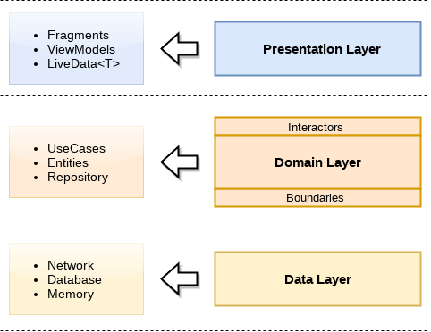

## MostPopular Movies Sample 
Android Sample app to show user top popular movies implementing MVVM + Clean Architecture using kotlin .

## screen Shots

  
  
  

## Clean Architecture
Image demonstrate the clean architecture.

## Android 3 Layers Architecture
Image demonstrate best best way for make layers for application i have follow packaging by features.

## Contribution
Please feel free to make a pull request or fork.

## Rate
If you find this repository useful please give it a star .

